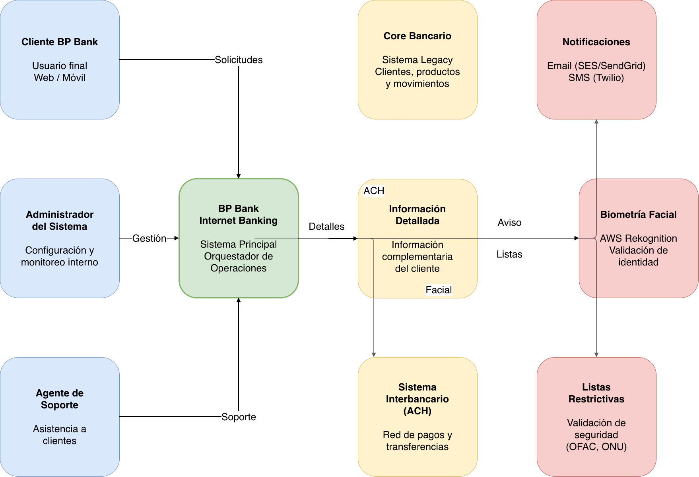
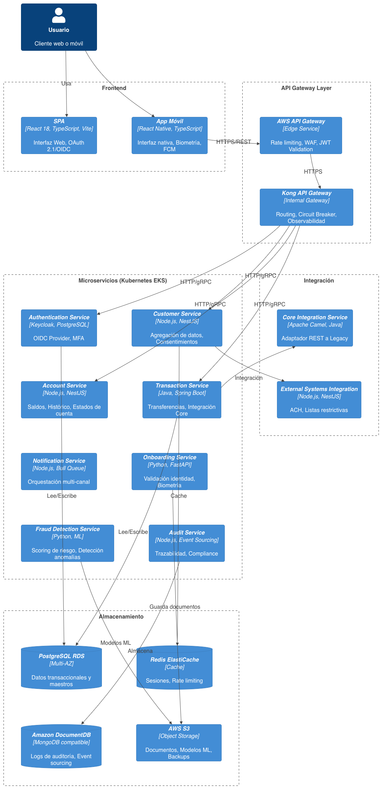
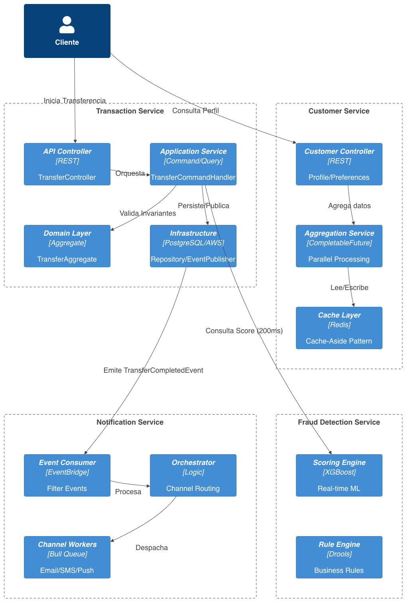

# BP Bank Internet Banking Architecture

## Descripción

Propuesta de arquitectura empresarial para la plataforma de banca digital de BP Bank.

La solución permite:

- Consulta de cuentas y productos financieros
- Consulta de movimientos y saldos
- Transferencias internas e interbancarias (ACH)
- Onboarding digital con validación biométrica
- Gestión de clientes
- Notificaciones transaccionales
- Auditoría y cumplimiento regulatorio

La arquitectura está diseñada bajo principios de escalabilidad, seguridad, resiliencia y desacoplamiento utilizando microservicios desplegados sobre AWS.

---

# Arquitectura General

La solución se basa en:

- Arquitectura de Microservicios
- Domain Driven Design (DDD)
- CQRS
- Event-Driven Architecture
- Saga Pattern
- Repository Pattern
- Cache-Aside Pattern
- Circuit Breaker

---

# Diagramas Arquitectónicos

## Context Diagram

Describe los actores principales, sistemas externos e interacciones de alto nivel de la plataforma.

---

## Container Diagram

Presenta la distribución de contenedores lógicos, microservicios, gateways, almacenamiento e infraestructura de ejecución.

---

## Component Diagram

Detalla la composición interna de los servicios críticos y la aplicación de patrones arquitectónicos.

---

## Arquitectura de Autenticación

Modelo de autenticación y autorización basado en Keycloak, OAuth 2.1, OpenID Connect y MFA.

---

# Tecnologías Seleccionadas

## Frontend

- React 18
- TypeScript
- Vite
- React Native

## Backend

- Java Spring Boot
- NestJS
- FastAPI

## Seguridad

- Keycloak
- OAuth 2.1
- OpenID Connect
- MFA
- AWS Rekognition

## Persistencia

- PostgreSQL
- Redis
- Amazon DocumentDB
- Amazon S3

## Infraestructura

- AWS EKS
- AWS API Gateway
- Kong Gateway
- CloudWatch
- Prometheus

---

# Cumplimiento y Seguridad

La propuesta considera:

- PCI-DSS
- ISO 27001
- LOPDP
- AML/KYC
- OFAC
- MFA
- Auditoría centralizada
- Trazabilidad de eventos

---

# Documento Completo

📄 [BP Proposition](BP_Proposition/BP.pdf)

---

# Autor

Proyecto académico de Arquitectura Empresarial.

BP Bank Internet Banking Platform.
